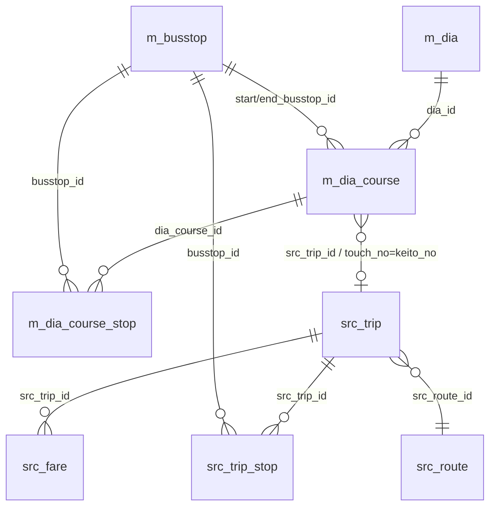

# 運行支援アプリ向け DB参照仕様（引き継ぎ資料）

しまバス乗務記録アプリ（新RDB版 / PHP+MySQL）のDBを、別途開発中の**運行支援アプリ**から
参照するための仕様共有資料。主対象は **バス停** と **ダイヤ（時刻）** 情報。

- 作成: 2026-08-16
- 対象DB: しまバス乗務記録（ロリポップ MySQL 8.0 / MariaDB, `utf8mb4` / `utf8mb4_unicode_ci`）
- スキーマ実体: `db/schema_mysql8.sql` ＋ `db/migration_*.sql`（追記式）／リポジトリ: GitHub private `KennyOka/shimabus-rdb`

---

## 0. 前提・接続

- **参照は読み取り専用（SELECT のみ）を想定**。書き込み・スキーマ変更は乗務記録/管理アプリ側のみ。
  - 推奨: 運行支援アプリ用に **SELECT 権限だけの専用MySQLユーザー**を作成して接続する。
- 接続情報（host / dbname / user / pass）は本書に**記載しない**。`api/config.php` の `db` セクション参照、または管理者から別途受領。
- 接続時は **`SET NAMES utf8mb4`**。時刻は基本 **JST**、`TIME`/`DATE`/`DATETIME` 型。
- 別ホストから参照する場合はネットワーク到達性（外部接続許可/リードレプリカ等）を要確認。

---

## 1. 参照テーブル一覧

| テーブル | 役割 | 主な使いどころ |
|---|---|---|
| `m_busstop` | バス停マスタ（標柱単位・**座標**） | 地図表示・停留所検索 |
| `m_dia` | ダイヤ（ヘッダ） | ダイヤ選択（番号×平日/土日祝） |
| `m_dia_course` | ダイヤのコース（実車/回送/点検…） | 運行の始発地→到着地・発時刻・系統 |
| `m_dia_course_stop` | 実車コースの**停留所別通過時刻** | 途中停の定刻・接近表示 |
| `src_trip` | しまバス便（参照スナップショット） | 便の系統・行先・始発時刻 |
| `src_trip_stop` | しまバス便の**停留所別時刻** | `m_dia_course_stop` 未整備時の補完 |
| `src_fare` | しまバス**運賃**（区間） | 運賃案内 |
| `src_route` | しまバス路線（参照） | 路線名 |
| `src_import_batch` | 取込バッチ（監査） | いつ時点のスナップショットか |

### ER 概要



---

## 2. コード定義

| 区分 | 列 | 値 |
|---|---|---|
| 運行区分 | `category` (m_dia_course) | 1=点検 2=回送 **3=実車** 4=未使用 5=清掃点検 |
| 方向 | `direction` (m_busstop) | 1=上り 2=下り 9=その他 |
| ダイヤ種別 | `day_type` (m_dia) | 1=平日 2=土日祝 |

> 運行支援アプリで「運行の時刻・経路」を扱う場合、通常は **`category=3`（実車）** のコースが対象。

---

## 3. テーブル定義（参照に必要な列）

### 3.1 `m_busstop`（バス停マスタ・標柱単位）
| 列 | 型 | 説明 |
|---|---|---|
| `busstop_id` | INT PK | バス停ID |
| `name` | VARCHAR(50) | バス停名 |
| `direction` | TINYINT | 1上り/2下り/9他 |
| `latitude` | DECIMAL(9,6) | **緯度**（NULLあり） |
| `longitude` | DECIMAL(9,6) | **経度**（NULLあり） |
| `kana` | VARCHAR(100) | よみがな（検索用） |
| `connection_note` | VARCHAR(255) | 接続情報テキスト（表示用） |
| `src_stop_id` | VARCHAR(20) | しまバス標柱ID |
| `src_busstop_id` | VARCHAR(20) | しまバス親バス停ID（例 286） |
| `is_active` | TINYINT(1) | 有効フラグ |

- **UNIQUE(name, direction)**。同名でも上り/下りは**別レコード（別 busstop_id）**。
- 座標が **NULL** の停留所あり（しまバス未取得分）。地図表示時はNULLチェック必須。

### 3.2 `m_dia`（ダイヤ・ヘッダ）
| 列 | 型 | 説明 |
|---|---|---|
| `dia_id` | INT PK | ダイヤID |
| `dia_no` | CHAR(4) | ダイヤ番号 0001-9999 |
| `day_type` | TINYINT | 1平日/2土日祝 |
| `name` | VARCHAR(50) | 名称（任意） |
| `is_active` | TINYINT(1) | 有効フラグ |

- **自然キー = (dia_no, day_type)**（UNIQUE）。`dia_no` 単独では平日/土日祝を区別できない。

### 3.3 `m_dia_course`（ダイヤのコース）
| 列 | 型 | 説明 |
|---|---|---|
| `dia_course_id` | INT PK | コースID |
| `dia_id` | INT FK→m_dia | 所属ダイヤ |
| `seq` | INT | コース順 |
| `digital_no` | VARCHAR(10) | デジタル番号（運賃表示器搭載車） |
| `touch_no` | VARCHAR(10) | **タッチ番号＝しまバス系統番号（連結キー）** |
| `settlement_flag` | TINYINT(1) | 納金あり |
| `connection` | VARCHAR(100) | 接続情報（乗換・表示用） |
| `category` | TINYINT | 区分（2章参照） |
| `start_busstop_id` | INT FK→m_busstop | 始発バス停（実車時） |
| `start_name` | VARCHAR(50) | 始発地名（回送/点検の手入力） |
| `end_busstop_id` | INT FK→m_busstop | 到着バス停（実車時） |
| `end_name` | VARCHAR(50) | 到着地名 |
| `src_trip_id` | INT FK→src_trip | 割当済しまバス便（実車時） |
| `departure_time` | TIME | 発時刻（始発時刻） |
| `note` | VARCHAR(100) | 備考 |

- 実車は `start/end_busstop_id` が座標つきバス停を指す想定。回送/点検は `*_name` のみ（`busstop_id` は NULL のことが多い）。
- **表示名は `COALESCE(start_name, m_busstop.name)`** のように名優先→マスタ名で解決すると安全。

### 3.4 `m_dia_course_stop`（実車コースの停留所別通過時刻）
| 列 | 型 | 説明 |
|---|---|---|
| `id` | INT PK | |
| `dia_course_id` | INT FK→m_dia_course | 所属コース |
| `seq` | INT | 通過順 1,2,3… |
| `busstop_id` | INT FK→m_busstop | 通過標柱 |
| `scheduled_time` | TIME | 通過定刻 |
| `ride_type` | TINYINT | 乗降区分（将来拡張枠） |

- **実車コースのみ・整備状況に依存**（全実車で揃っているとは限らない）。
  未整備の場合は **`src_trip_stop`（系統番号＋発時刻で照合）** で補完可能（3.5 / クエリ D）。

### 3.5 しまバス参照テーブル `src_*`（スナップショット）
- `src_trip`: `src_trip_id`(PK), `trip_key`, `src_route_id`, **`keito_no`（系統番号＝`m_dia_course.touch_no` の連結キー）**, `service_name`, `headsign`(行先), `origin_busstop_id`, `first_departure`(始発発時刻), `target_date`(スナップショット基準日)。UNIQUE(trip_key, target_date)。
- `src_trip_stop`: `src_trip_id`(FK), `seq`, `busstop_id`(FK→m_busstop), `arrival_time`, `departure_time`。便の停留所別時刻。
- `src_fare`: `src_trip_id`(FK), `from_seq`, `to_seq`, `to_busstop_id`, `price`(円)。区間運賃。
- `src_route`: `route_key`, `route_name`。
- **注意**: `src_*` は取込のたび **上書き** される「参照スナップショット」で `target_date` 基準。恒久マスタではない。最新を使うなら `target_date DESC` で1件に絞る。

**連結キー**: `m_dia_course.touch_no = src_trip.keito_no`（紙ダイヤの系統番号としまバス便）。
特定便が割当済なら `m_dia_course.src_trip_id` で直接参照可。

---

## 4. 参照クエリ例

**A. 全バス停（座標つき・有効のみ）**
```sql
SELECT busstop_id, name, direction, latitude, longitude, kana
FROM m_busstop
WHERE is_active = 1 AND latitude IS NOT NULL;
```

**B. 指定ダイヤのコース一覧（発着地名＋到着地座標＋発時刻）**
```sql
SELECT c.seq, c.category, c.touch_no,
       COALESCE(c.start_name, s.name) AS start_place,
       COALESCE(c.end_name,   e.name) AS end_place,
       c.departure_time,
       e.latitude AS end_lat, e.longitude AS end_lon
FROM m_dia d
JOIN m_dia_course c ON c.dia_id = d.dia_id
LEFT JOIN m_busstop s ON s.busstop_id = c.start_busstop_id
LEFT JOIN m_busstop e ON e.busstop_id = c.end_busstop_id
WHERE d.dia_no = '0031' AND d.day_type = 1     -- 平日
ORDER BY c.seq;
```

**C. 実車コースの停留所別通過時刻（座標つき）**
```sql
SELECT cs.seq, b.name, b.latitude, b.longitude, cs.scheduled_time
FROM m_dia_course c
JOIN m_dia_course_stop cs ON cs.dia_course_id = c.dia_course_id
JOIN m_busstop b          ON b.busstop_id     = cs.busstop_id
WHERE c.dia_course_id = ?          -- 対象コース
ORDER BY cs.seq;
```

**D. `m_dia_course_stop` が無い実車を、しまバス便で補完（系統＋発時刻で照合）**
```sql
SELECT st.seq, b.name, b.latitude, b.longitude, st.arrival_time, st.departure_time
FROM src_trip t
JOIN src_trip_stop st ON st.src_trip_id = t.src_trip_id
JOIN m_busstop b      ON b.busstop_id   = st.busstop_id
WHERE t.keito_no = ?               -- m_dia_course.touch_no
  AND t.first_departure = ?        -- m_dia_course.departure_time
ORDER BY t.target_date DESC, st.seq;   -- 最新スナップショット
```

**E. 区間運賃**
```sql
SELECT from_seq, to_seq, to_busstop_id, price
FROM src_fare WHERE src_trip_id = ? ORDER BY from_seq, to_seq;
```

---

## 5. 運用上の注意

- **読み取り専用**で参照（SELECT 専用ユーザー推奨）。書き込みは行わない。
- **座標NULLの停留所あり** → 地図表示時はNULL除外/補完。
- **標柱単位**（上り/下りで別 busstop_id）→ 地図ピン重複や上下判定に注意。
- **`m_dia_course_stop` は実車のみ・整備依存** → 無ければ `src_trip_stop`（系統＋発時刻）で補完。
- **`src_*` は上書きスナップショット**（`target_date` 基準）。恒久マスタとして扱わない。
- ダイヤ自然キーは **(dia_no, day_type)**。番号だけで平日/土日祝を混同しない。
- 文字コードは **utf8mb4**。

---

## 6. 変更管理・連絡

- スキーマ変更は乗務記録アプリ側で `db/migration_*.sql` として追記 → 本書も更新。
- 参照側で必要な列/テーブルが増えたら管理者へ連絡（列追加は DB→api→app.html の3点セットで反映される運用）。
- 本書・スキーマは GitHub private `KennyOka/shimabus-rdb` の `db/` 配下で管理。
